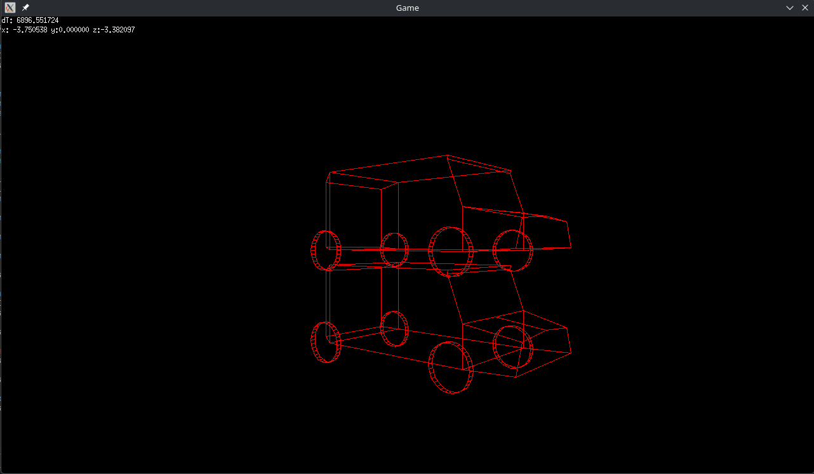

# WireFrame engine

This game engine is completely wireframe and runs only on CPU! <br>
[LICENSE](LICENSE.md) - [CONTRIBUTING](CONTRIBUTING.md) <br>



### Why did I decide to make this engine?

I wanted to attempt to do a project using 2 technigues:

1) Rasterization: I always found it interesting how can you translate 3D polygons to 2D space, and I wanted to try it for myself. I already tried ray tracing and ray marching before, so why not rasterization now? (its alot harder than raymarching, true me...)

2) Dynamic linking: I wanted to find an actual good use to load shared dynamic objects(libraries) to the program while not previously knowing what they do or are and work independently, and turns out its actually quite nice to do it this way! It also makes moding quite alot easier.

### Scripting and modding

All communication in the scripts is handled by the GameData variable, 
commonly called gd in the argument, and d in the global space. <br>
[Script Example](game/script.cc)

Compiling the script:
`clang++ -shared -fPIC <SCRIPT>.cc types.cc -o .../bin/scripts/<SCRIPT>.so`<br>
The `types.cc` is technically isn't requied by the script to work and for the functions to execute, but I would
advise aginst not importing `types.cc`, because it makes the development process so much easier, and avoids the
issues with missing functions, etc.<br>

*Why doesn't the game work with my version of engine that I compiled myself?*
The engine itself may be modified by the specific game needing some specific features due to the scripts, such as bigger data stream, or complete overhaul of the typer header. Simply, every copy of the engine isn't compatible with every single copy of any game made with the engine.

### Data stream

The engine includes a data stream for communication between multiple scripts, which can be accessed by going to `gamedata->stream`. Its mainly used to store pointers to structs inside the source script, instead of storing the entire struct inside it, even tho it is possible. Shortly said, its just an array of unsigned 8bits, however most of the time you will find it being casted into pointer array. Its size will range somewhere in the kilobytes, depending on the size of your game settings, but the default is 8192bytes. <br>

*How to resize this data stream on runtime?* <br>
You can just point another data stream at the end of the first one, which will extend the data capacity of the stream.
Sadly, theres no other easy way

*How to quickly get the streams size?* <br>
You can simply get the `streamSize` variable inside the `types.hh's` gamedata struct.<br>

#### Uses for the data stream
0 - Scene management  <br>
1 - Nothing           <br>
2 - Collision manager <br>
3 - Audio manager     <br>
4 - Physics manager   <br>

### Video settings

The engine currently uses X11 to display graphics<br>

*Can I change the resolution at runtime?*<br>
No, sadly I didn't yet figure out how to do so. You need to change it when compiling the code. As for the aspect ratio, its preety flexible at scaling the models propertly, so even playing it on a smartphone shouldnt be a problem! <br>

*Is the framerate unlimited?* <br>
Yes, the framerate is currently capped at ~1000FPS!(1000us). To change the framerate, you can just change the sleep time constant value in `program.hh` to wait different amount of microseconds, or remove it completely.

### Porting

Porting the wireframe engine should be really, really easy compared to other engines, because majority of the engine does not relly on anything but few components clib or c++lib. You only need to port few files, depending on the platform.

So these are the files you will propably need to edit                      <br>
`scripting.cc`   - Includes the scriptloading etc.                         <br>
`native.cc`      - Includes the graphics and everything about the window   <br>
`file.cc`        - Includes fileloading(includes dirent)                   <br>
`net.cc`         - Includes UDP/IP implementation                          <br>
<br>

`game/saving.cc` - Includes fileloading and filesaving                     <br>
`game/scene.cc`  - Includes fileloading                                    <br>
`game/audio.cc`  - Includes native audio(right now using openal)           <br>
<br>

What libraries do you need to change exactly?<br>
- `dirent.h` - In file.hh     <br>
- `dlfnc.h`  - In scripting.hh<br>
- `x11lib.h` - In native.cc   <br>
- `signal.h` - In native.cc   <br>
- `socket.h` - In net.cc      <br>
- `typeof`   - Preety much everywhere,
but its possible to only implement its macro in types.hh and it should work
- `sizeof`   - Also Preety much everywhere :D,
but its possible to only implement its macro in types.hh and it should work<br>
<br>

### Optimilization

`renderer.cc` - Basically, renderer.cc is optimized very well, and its really hard to read it. 
If you're wondering why I didn't use loops in it, and when I did, I've written `#pragma unrool` in front of every loop that had set iteration count, its because loops are slow(they take about 4 clock cycles per one iteration). And renderer is something that needs to be really really fast, so its best if no loops exist. Everything else is not too optimized, but I would say its still optimized quite a bit. <br>
So if you don't know what you're doing, do not enter renderer.cc. It doesn't require to be edited if ported, so no need there etc.<br>
Also, if you manage to make it more readable please sumbit a PR :D. Thanks! <br>

As for the other files, they can for sure be optimized, and if you manage to do so, submit a PR!<br>

### Internal components

These are some scripts, that have been integrated by default for easier development [components readme](game/game.md#internal-components)
<br>

#### Audio

Including audio.hh in your script allows you to allow audio in your game. <br>
You just need to get the AudioControl struct from the pointer located at the above mentioned stream, which allows you to access all the important functions,
which are are self explanatory by themselves!<br>
You can also edit tracks while they are already playing using the AudioSource struct.

#### Saving

For easier managing of saves, the saving system has created in saving.cc. You can simply add a `saveinforequest` which will trigger the referenced function when its time to save, and your function will simply return all the data it needs to save, as well as the location(node number) where to store them in, and the the system will automatically order and save all the packets.

#### Scene managing

There are 2 options on how to manage your scenes in the engine, which both end the same way.. by being converted to binary, the text form and the graphical form<br>

##### Text scene manager:

You can still use the text scene designer, which consists of 4 sections(.S = scripts, .M = models, .O = objects, .U = unload when the scene ends)<br>
I wouldn't recomend it, but you can simply do it using 4 secitions placed like:<br>
`objectfile.txt`: <br>
```
/path/to/object1.obj
/path/to/object2.obj
```
`scriptfile.txt`: <br>
```
/path/to/script1.so
/path/to/script2.so
```
...

You can simply place the paths for models and scripts and models to be unloaded, then add the object properties using normal decimal numbers in the default order, and the scene can be then converted to the binary form using the scene convertor utility<br>
More info at [the text scene convertor readme](utilities/utilities.md#scenemkr)

##### Blender scene manager

You can now simply design scenes using the new blender extension to design the scenes inside familiar blender UI! <br>
For more info, you can go in [the utilities readme](utilities/utilities.md#blender-extension) and find out more.

#### Collision

The engine currently uses AABB collision. Every gameobject has its own collsion box(defined by position + AABB), and you can enable collision for specific object by pushing its id to the list of them in stream positon 2. <br>
The collison system will then automatically send you back the data with the collision status in form of the `go.colliding` unsigned integer, which also declares where it collided it with.

#### Game specific components

More info about them [here](game/game.md#game-specific-scripts).

### Models

This engine originally used OBJ's for encoding models, but it was replaced by an optimized binary version. If you want to optimize your models with it, just try to load the OBJ file via the engine, and it will automatically get converted to the optimized version, or use the object optimizer inside the utilities, where you can also partially decompile/fully it back to OBJ, depending on if your object had any texture or lighting data.

### Security

Currently, there are none known security vulnearibilities. <br>

Please, do not download 3rd party mods if you can't see the source without first checking with something like virustotal.
The mods are effectively just plain binaries full of machine code, and the engine has no control over them and neither do I, so its on your own risk to download 3rd party mods, or even 3rd party games.

### Index 0 thingies

##### Script
Empty script, which can be used when your game object doesn't need a script. Its also faster than loading empty script, so please use it.

##### Model
Empty model, thats invisible and can be used for scripts when putting empty objects to recieve update and start signals.

### Networking

The engine provides a simple UDP interface in the net.o object, as well as its header, net.hh. <br>
That provides your game with such instructions as send, recieve packets and also host and start an server. <br>
Warning: If your external server is using TCP(or anything else than SOCK_DGRAM), the integrated networking
is preety much always incompatible with that.

### Contents of the files
By the way, this engine uses .hh instead of .hpp and .cc instead of .cpp for anything, but the main file(entrypoint) <br>
`program.cpp` - Contains primarily main loop and some init code                             <br>
`scripting.cc`- Contains scripting funcs like loading script, getting its subfunctions, etc.<br>
`renderer.cc` - Contains the rendering funcs, such as matrix-vector multiplication etc.     <br>
`math.cc`     - Might contain custom functions on some ports(and maxmin function rn)        <br>
`native.cc`   - Handles IO operations currently using only x11                              <br>
`audio.cc`    - Script playing audio using OpenAL(and sndfile)                              <br>
`file.cc`     - Mainly model loading, and some other file utils                             <br>
`types.cc`    - Extension for `types.hh` and utilities for matrixes such as rotation        <br>
`mscript.cc`  - Startup script for the engine, it should load and set up all the other ones <br>
`Makefile`    - Script for building the engine                                              <br>

Didn't find the file you were searching for? <br>
You might want to check the [utilities readme](utilities/utilities.md) or 
the [components readme](game/game.md)

### Method of storing most of the data

This engine has its own proprietary filetypes, each for different use, but the storing way stays the same,
and that is:

`size of elements`               - Commonly an ushort <br>
    `size of element(if needed)` - Commonly 1 byte(X) <br>
        `element`                - X bytes long       <br>

### Contributing
I will be glad for every contribution, in form of pull request, as long as you folow these rules and details:
[Contributing rules](CONTRIBUTING.md)

### Why does this project use partialy python?

Sadly, blender only supports extensions made in python.
If they ever release better variant, I will make sure to update this repo, if I will still be maintaining it that time.<br>
Tho if you see this in a tar archive and the repo is long gone, I am propably not maintaining it anymore<br>
    
